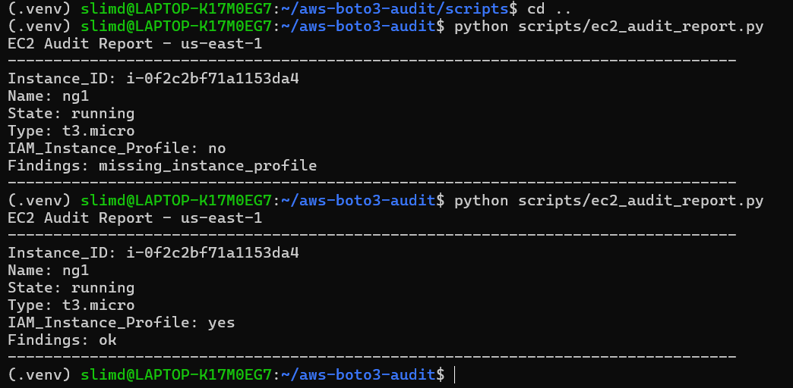

# AWS Boto3 EC2 Audit Lab

A Python-based audit tool that uses boto3 to evaluate EC2 instances for basic security and governance best practices.

## Overview

This project demonstrates how to interact with AWS programmatically using Python to:

- Retrieve EC2 instance data via the AWS SDK (boto3)
- Analyze instance configuration
- Identify common issues such as:
  - Missing `Name` tags
  - Missing IAM instance profiles
- Produce a readable audit report

The project was built incrementally, starting from simple scripts and evolving into a structured, testable tool with CI validation.

---

## Features

- ✅ EC2 instance discovery via boto3  
- ✅ Tag validation (Name tag)  
- ✅ IAM instance profile validation  
- ✅ Human-readable audit report  
- ✅ Unit-tested audit logic  
- ✅ CI pipeline with linting and automated tests  

---

## Example Output



Sample report output:
EC2 Audit Report - us-east-1
Instance ID: i-xxxxxxxxxxxxx
Name: ng1
State: running
Type: t3.micro
IAM Instance Profile: no
Findings: missing_instance_profile

---

## Setup

```bash
git clone <repo>
cd aws-boto3-audit
python -m venv .venv
source .venv/bin/activate
pip install -r requirements.txt
aws configure

